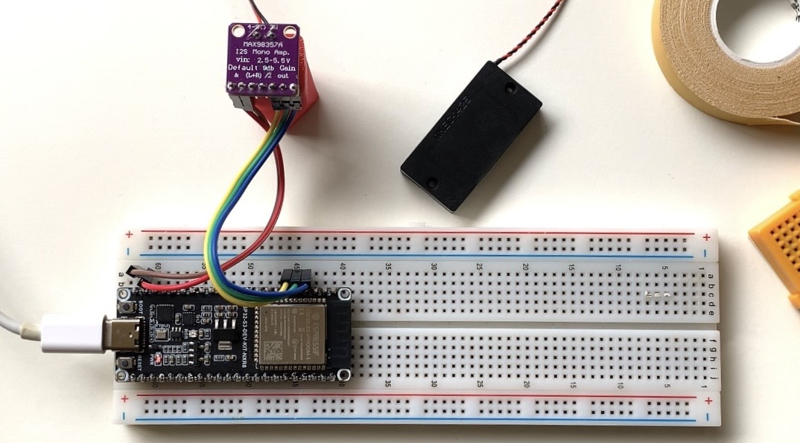
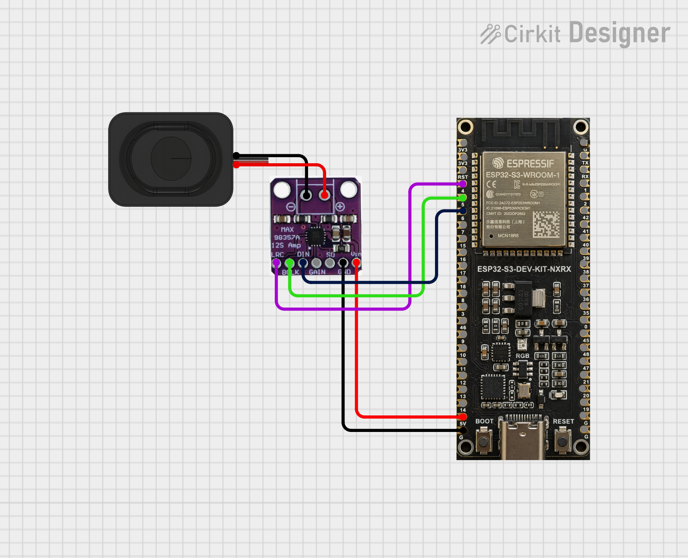

# ESP32-S3 I2S Network Radio Player (Demo)

This project is a high-performance internet radio streamer demonstration utilizing the **ESP32-S3** microcontroller and the **MAX98357A** I2S DAC. It provides a robust starting point for developers and hobbyists looking to implement high-quality MP3 audio streaming.

  
   
  <em>The assembled prototype with ESP32-S3 and Side-firing cavity speaker.</em>

---

## 1. Project Description

This demo showcases how to leverage the hardware I2S interface of the ESP32-S3 to drive an external DAC for real-time audio decoding.

### Key Features:
* **Seamless Streaming**: Connects via WiFi to fetch live ICY (Shoutcast/Icecast) streams.
* **Enhanced Buffering**: Implements a 128KB deep-buffer strategy to mitigate network jitter and prevent audio stuttering.
* **Dual-Core Optimization**: Configured to run at 240MHz, ensuring the ESP32-S3 handles MP3 decoding with significant overhead for additional tasks.
* **Hardware Ready**: Optimized for compact setups, such as side-firing cavity speakers, with adjustable software gain control.

---

## 2. Prerequisites

Before uploading the code, ensure your environment meets the following hardware and software requirements.

### 🛠 Hardware Requirements

| Component | Specification |
| :--- | :--- |
| **Microcontroller** | ESP32-S3-DevKitC-1 (or any ESP32-S3-WROOM-1 variant) |
| **Audio DAC** | MAX98357A I2S Class-D Amplifier |
| **Speaker** | 4-8 Ohm Mono Speaker (Side-firing cavity speaker recommended) |

#### Wiring Diagram

#### Default Pinout (I2S):
* **LRC (WS)** -> GPIO 4
* **BCLK (SCK)** -> GPIO 5
* **DIN (SD)** -> GPIO 6
* **VIN** -> 5V
* **GND** -> GND

### 💻 Software Environment
* **Arduino IDE**: Version 2.0 or higher recommended.
* **ESP32 Arduino Core**: Version 2.0.x or higher.
* **Required Library**: 
    * [ESP8266Audio](https://github.com/earlephilhower/ESP8266Audio) (Search and install via the Arduino Library Manager).

---

## 3. Disclaimer

* **For Educational Use**: This project is provided "as-is" for technical exchange and DIY reference only. It is not intended for production environments.
* **No Liability**: The author assumes no responsibility for hardware damage, data loss, or any issues arising from the use of this code.
* **Stability**: While optimized, stability may vary based on network conditions and specific hardware revisions.
* **Content Rights**: Audio stream URLs (e.g., SomaFM) are the property of their respective owners. Please respect the terms of service of the streaming providers.

---

